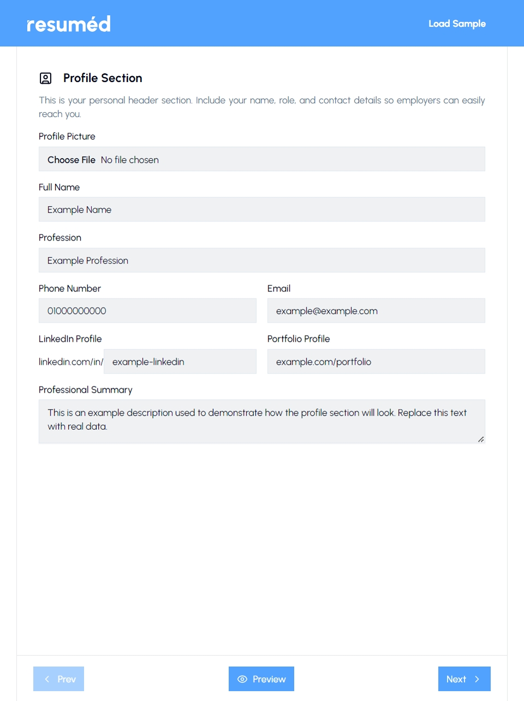

<div align="center">
  

  ### a simple resume builder by [mariware](https://github.com/mariware)
  Create, preview, and download a resume easily. [Live Demo: resuméd](https://resumed-by-mariware.vercel.app)
</div>

## 📖 Features

**resuméd** is a lightweight, user-friendly tool designed to help individuals quickly create their own resume. It focuses on simplicity and accessibility, guiding users through a structured form while generating a real-time preview of the resume.

- ✍️ **User Input Form**: Fill out details like contact info, education, work experience, and skills.  
- 📄 **Real-time Resume Preview**: Instantly see updates with a PDF preview.  
- 📥 **Download as PDF**: Export resumes in a PDF format.  
- 🎨 **Responsive Design**: Works on desktop and mobile screens.  

## 🚀 Tech Stack

This app is built with  **[Next.js](https://nextjs.org/)** primarily for its project structure and routing. It is developed on  **[React](https://react.dev/)** for modular, component-based rendering and efficient state management. It is styled with  **[TailwindCSS](https://tailwindcss.com/)** for a responsive and maintainable UI design. The app is also integrated with **[React-PDF](https://react-pdf.org/)** for generating, previewing, and downloading resumes in PDF format.

## 📦 Installation

Clone the repository:

```bash
git clone https://github.com/yourusername/resume-builder.git
cd resume-builder
```
Install dependencies:

```bash
npm install
```

Run the development server:

```bash
npm run dev
```

The app will be available at `http://localhost:3000`.

## 📸 Screenshots

<div align="center">
  
  
  
</div>

## 📝 Notes

This project was created as part of [The Odin Project's Full Stack Course](https://www.theodinproject.com/lessons/node-path-react-new-cv-application). It is intended as a practice project.